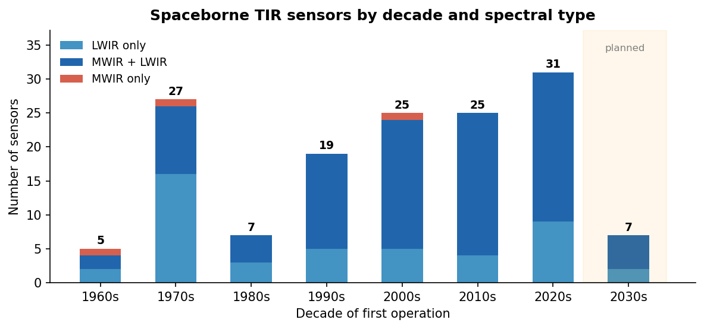

# A Data-Driven Perspective on Spaceborne Thermal Infrared Sensing

*Supplementary analysis for: Rezaie, H. & Hay, G. J. (2026). The Past, Present and Future of Thermal Remote Sensing. MDPI Remote Sensing.*

---

## Six Decades, Three Eras

The 171 sensors in this dataset — drawn primarily from the WMO OSCAR instrument database [1] — tell a story with a clear structure. The first 30 years (1960–1990) were about proving the concept: a handful of government labs building one instrument at a time, mostly whiskbroom radiometers with passive cooling, mostly meteorological. The next 30 years (1990–2020) were about scientific maturity — hyperspectral sounders, cryogenically cooled imagers, and the first systematic land surface temperature records from ASTER, MODIS, and Landsat [2]. The 2020s are something different: 31 new sensors in a single decade, with commercial operators entering a space that was previously the exclusive domain of NASA, ESA, JAXA, and Roscosmos.

*Figure 1. Spaceborne TIR sensors first operated per decade. The 2030s bar reflects only confirmed planned missions. MWIR+LWIR sensors (dark blue) dominate modern deployments, reflecting the maturity of broadband focal-plane array (FPA) detector design [3].*

Two numbers stand out from the timeline. First, sensors that cover both MWIR and LWIR (3–15 µm) have grown from 2 in the 1960s to 22 in the 2020s — not because single-band instruments disappeared, but because broadband FPA detectors made it cheap to cover the full atmospheric window [3]. Second, pure MWIR sensors remain rare (6 across 60 years) because detecting at 3–5 µm in daylight requires rejecting solar-reflected radiation, adding optical complexity. Most broadband sensors handle this with temporal filtering rather than spectral separation.

---

## Why LWIR Cannot Match MWIR Resolution — and What It Would Take

The spatial resolution gap between MWIR and LWIR is not a funding or engineering priority problem. It is physics — and the physics has three interlocking layers.

**Layer 1: Diffraction.** The Rayleigh criterion sets a hard floor: the minimum resolvable angle is 1.22 λ/D, where λ is wavelength and D is aperture [4, 5]. At 705 km altitude, achieving 30 m ground resolution requires only a 7 cm aperture at visible wavelengths (0.66 µm), a 30 cm aperture at MWIR (3.7 µm), and an 88 cm aperture at LWIR (10.8 µm). To replicate HOTSAT-1's 3.5 m MWIR resolution in the LWIR band would require an aperture of approximately **2.7 metres** in orbit — more than twice the primary mirror of Landsat 9. The 30 m LWIR resolution delivered by Landsat TM since 1982 corresponds to an aperture of roughly 26 cm: already near the practical ceiling for a conventionally-launched satellite.

*Figure 2. Rayleigh diffraction limits (lines) and actual sensor performance (dots) at 705 km altitude. MWIR sensors can approach or exceed 5 m resolution with compact apertures (0.2–0.5 m). LWIR sensors are pinned to 30–100 m with the same hardware because wavelength is 3× longer.*

**Layer 2: Detector pixel pitch.** Diffraction sets the optical blur spot; detector pixel pitch determines whether you can sample it. Holst & Driggers [6] established that the minimum useful pixel size under F/1 optics is approximately 2 µm for MWIR and 5 µm for LWIR — a ratio driven directly by wavelength. Below these sizes, diffraction spreads energy across multiple pixels and SNR collapses [6, 7]. Larger minimum pixel pitch means fewer pixels fit on a given focal-plane array, constraining either the field of view or the ground sampling distance. Shrinking pixels below the diffraction-limited optimum does not improve resolution; it only reduces signal per pixel with no spatial gain.

**Layer 3: Cooling and detector noise.** HgCdTe LWIR detectors require cooling to 70–77 K for background-limited performance, versus 150–200 K for MWIR HgCdTe [8, 9]. Lower operating temperature means heavier cryocoolers, higher power draw, and more complex thermal control — all of which consume mass and volume that could otherwise go toward a larger aperture. NEDT for an uncooled LWIR bolometer is typically 30–50 mK, versus 10–20 mK for a cryogenically cooled HgCdTe array [10]. Better NEDT does not compensate for larger diffraction-limited blur, but it makes smaller pixels impractical since SNR would be unacceptable regardless.

The data confirm all three layers operating simultaneously. The best operational LWIR-only ground resolution today is 30 m (Landsat TM/ETM+, HiVE), with ECOSTRESS at 38 m and TIRS at 100 m. Every MWIR sensor at comparable or better resolution sidesteps the aperture penalty by using a shorter wavelength: HOTSAT-1 at 3.5 m (3.7 µm), IIP at 5.5 m (3–5 µm), Clarity at 2 m (3–5 µm).

SuperSharp's planned 3 m LWIR imager addresses this directly with a deployable, self-aligning telescope that unfolds to roughly 1.2 m aperture after launch [11] — the only credible path to sub-5 m LWIR resolution from orbit today. LSTM (50 m) and SBG-TIR (60 m) represent the institutional mainstream: missions that deliberately accepted the 30–60 m LWIR floor rather than attempt the engineering risk of a deployable primary mirror.

The practical implication is unambiguous: if sub-30 m thermal data is needed today, the choice is MWIR (3–5 µm). LWIR (8–14 µm) delivers better sensitivity for ambient surface temperatures, no solar reflected contamination, and stronger emissivity contrast — but at a spatial resolution cost that three layers of physics make very expensive to overcome.

---

## Detector Technology: The Arc from Uncooled to Cryogenic and Back

The earliest TIR satellites in the 1960s used uncooled detectors — simple bolometers and thermistor bolometers requiring no cooling hardware. This was partly necessity (Stirling coolers were not flight-qualified) and partly acceptance of lower sensitivity for coarse-resolution meteorological work [9].

The 1990s marked the inflection point. Cryogenically cooled HgCdTe and InSb detectors, enabled by reliable Stirling-cycle mechanical coolers, became the standard for any sensor requiring high sensitivity or MWIR capability [8, 9]. ASTER, ATSR, SLSTR, CrIS, IASI — all use cryogenic cooling. By the 2000s, cryogenic and passive-radiative sensors were roughly equal in number, reflecting a field that had bifurcated: precision science instruments went cryogenic, moderate-resolution imagers stayed passive.

*Figure 3. Detector cooling by decade. Cryogenic sensors peaked in the 2000s alongside the EOS era (MODIS, ASTER, AIRS, CrIS). The resurgence of uncooled sensors in the 2020s reflects new-space entrants using microbolometer arrays that accept lower sensitivity in exchange for zero moving parts, drastically reduced mass, and lower cost [10, 12].*

The 2020s resurgence of uncooled sensors is a deliberate trade. A microbolometer constellation of 20 satellites with 200 m resolution and 3-hour revisit can outperform a single cryogenic satellite at 100 m and 16-day revisit for wildfire detection or infrastructure monitoring [12]. OroraTech's FOREST series operates on exactly this logic. The hard limit is that uncooled bolometers cannot reach NEDT below ~30 mK [10], making them unsuitable for sea surface temperature retrieval or precise land surface temperature science, where cryogenic sensors remain irreplaceable.

---

## The New-Space Inflection and What It Means

Before 2020, 9 of the top 10 agencies by sensor count were government space agencies. NASA alone accounted for 22% of all sensors in this dataset [1]. That structure has not reversed, but it is under pressure. Nine commercial TIR sensors are now operational or in deployment, most launched after 2022 [1]. Their resolution targets (3–30 m), revisit models (hours, not days), and data-as-a-service business models are structurally different from the government baseline [12].

The gap that commercial operators are filling is temporal resolution at high spatial resolution. Landsat 8/9 gives 30 m thermal data every 8 days over a given point. ECOSTRESS covers the ISS footprint with variable overpass timing. No single satellite currently delivers sub-50 m TIR imagery at sub-daily revisit globally. HOTSAT-2/3, LSTM, TRISHNA, and the new commercial players are all explicitly targeting this gap — arriving at the same design problem from different directions (government science, commercial agriculture, industrial monitoring) [2, 11, 12].

Whether the LWIR resolution barrier at 30 m can be broken operationally before 2030 depends on SuperSharp's deployable telescope demonstrating on-orbit performance [11]. If it does, the decadal resolution trend — stalled at 30 m since 1982 for LWIR — will break for the first time.

---

## Why Cooling a Microbolometer Does Not Buy HgCdTe Sensitivity

A common assumption: if cryogenic cooling transforms HgCdTe performance, why not cool a microbolometer array to the same temperature and close the sensitivity gap? The answer reveals that bolometers and HgCdTe detectors belong to fundamentally different physical families — and no amount of engineering can bridge the divide.

**Thermal detectors versus photon detectors.** A microbolometer absorbs infrared radiation, converts it to heat, and measures the resulting resistance change. Its noise floor is set by phonon noise — random fluctuations in the thermal energy exchanged between the absorber and its surroundings — which scales as √(4kTGΔf), where k is Boltzmann's constant, T is the detector temperature, and G is the thermal conductance to the heat sink [13]. A HgCdTe photodetector works by an entirely different mechanism: absorbed photons directly promote electrons across a semiconductor bandgap, generating a photocurrent. The noise is shot noise from the photon flux — quantum in origin, not thermal [8, 9]. These are not two points on a single continuum; they are different physics.

**The cooling paradox.** For a bolometer to function, it needs high thermal isolation (low G) so that absorbed radiation causes a measurable temperature rise. Cooling the detector to 77 K does not help: the heat sink is now 77 K, the thermal gradient driving signal collapses, and the bolometer becomes *less* responsive to room-temperature scene photons. Reducing G to compensate slows the thermal time constant, limiting frame rate and dynamic range [13, 14]. The bolometer faces an irresolvable trade-off: cooling reduces Johnson noise but suppresses responsivity by an equal or greater factor.

**The D\* gap.** Specific detectivity D\* — the standard figure of merit for detector sensitivity — makes the gap quantitative. An uncooled microbolometer at 10 µm achieves D\* of roughly 10⁸–10⁹ cm·Hz½·W⁻¹. Cooling to 77 K can improve this to ~10¹⁰. A background-limited HgCdTe photon detector at 77 K achieves D\* > 10¹² — two orders of magnitude higher [8, 10]. This is not a manufacturing gap or a research priority gap; it is the thermodynamic ceiling on thermal detection versus the quantum limit of photon detection.

**What the data show.** All 33 uncooled sensors in this dataset use microbolometer or thermopile arrays; not one cryogenic sensor in this dataset uses a bolometer as its primary TIR detector. Every cooled thermal imager uses HgCdTe, InSb, or a quantum-well infrared photodetector (QWIP). This pattern is consistent across 60 years and every major space agency. The industry has not invested in cryogenic bolometer FPAs for spaceborne TIR imaging because the physics gives no reason to expect the investment would pay off.

---

## Why Land Surface Temperature Accuracy Has Not Improved in Step with Sensor Sensitivity

Thermal sensor NEDT has improved by a factor of roughly 25 since AVHRR — from ~500 mK in the 1970s to 20 mK in modern cryogenic HgCdTe arrays. Land surface temperature (LST) accuracy over complex terrain has improved by a factor of 2–3 over the same period, from ~2–3 K to ~0.5–1.5 K [15]. The divergence is not a calibration failure or a retrieval algorithm shortcoming. It reflects two error sources that are independent of sensor noise and have no engineering solution within the current measurement paradigm.

**Emissivity uncertainty: the inescapable degeneracy.** Spectral radiance measured by a TIR sensor at wavelength λ is L(λ) = ε(λ) · B(λ, T), where ε is surface emissivity and B is the Planck function at surface temperature T. For open ocean — emissivity ~0.993 ± 0.001, spatially uniform, well characterised — LST accuracy closely tracks sensor NEDT, and modern SST products achieve 0.1–0.2 K uncertainty [16]. For land surfaces, emissivity varies from 0.68 (polished metal roofing) to 0.99 (dense moist vegetation) and cannot be separated from temperature using radiance alone without additional assumptions. The temperature–emissivity separation (TES) algorithm developed for ASTER reduces the degeneracy by exploiting spectral contrast across multiple LWIR channels [17], but it cannot eliminate it: a 1% emissivity error at a 300 K surface propagates to approximately 0.7 K LST error regardless of how precisely the sensor is calibrated. No operational TIR sensor measures emissivity independently of surface temperature; every LST product relies on ancillary land-cover databases, vegetation fraction proxies, or algorithm constraints that carry systematic uncertainty beyond the sensor's noise floor.

**Atmospheric water vapour: a correction with a ceiling.** The 8–14 µm window is semitransparent. Precipitable water vapour (PWV) varies from under 5 mm in winter Arctic scenes to over 60 mm in tropical wet-season overpasses, introducing path radiance and atmospheric emission that must be removed. The split-window algorithm — first derived for AVHRR in the 1970s and still the backbone of MODIS, SLSTR, and ECOSTRESS LST products [16] — exploits differential absorption between two window channels near 11 µm and 12 µm to estimate and subtract this effect. Its accuracy ceiling of roughly 0.3–0.5 K is set by the stability of the assumed water vapour lapse rate and by PWV heterogeneity within the pixel footprint. Improving sensor NEDT from 50 mK to 20 mK does not relax this constraint: the algorithm's accuracy is limited by the atmospheric state, not by radiometric noise.

**The resolution paradox: better pixels, same accuracy.** Improving spatial resolution surfaces errors that coarser sensors averaged away. At 1 km (MODIS), a mixed urban-rural pixel's apparent LST is an area-weighted average of surfaces whose physical temperatures may differ by 15–20 K on a summer afternoon; the sub-pixel heterogeneity is absorbed into the spatial uncertainty budget and is rarely evaluated. At 30–60 m (ECOSTRESS, TRISHNA), the same heterogeneity appears as sharp discontinuities at sub-pixel scale that the product cannot resolve but can no longer disguise. Validation campaigns consistently find that higher-resolution sensors fail field validation over fragmented agricultural land and urban canopies at roughly the same absolute accuracy (~1 K) as their coarser predecessors [15] — not because the newer sensor is worse, but because it resolves the spatial complexity that the older sensor blurred over.

The implication is direct: a future 10 m LWIR imager with 5 mK NEDT would deliver no improvement in LST accuracy over current TIRS or ECOSTRESS unless matched by scene-level emissivity retrieval at the same spatial scale and collocated atmospheric profiling at sub-pixel resolution. The sensor stopped being the bottleneck at least two decades ago. The bottleneck is knowledge of the surface and atmosphere it is looking through.

---

## Not All "LWIR" Is the Same

When people talk about thermal remote sensing, they usually mean two clean atmospheric windows: MWIR around 3–5 µm and LWIR around 8–14 µm. Both are regions where the atmosphere is relatively transparent and Earth's surface emission comes through clearly.

This database follows WMO's broader classification — MWIR as 3–6 µm and LWIR as 6–15 µm — which quietly sweeps in a third region: the 6–8 µm water vapour absorption band. This part of the spectrum is not transparent at all. The atmosphere absorbs strongly here, which is exactly why it is useful — not for imaging the ground, but for profiling water vapour in the atmosphere. Instruments like AIRS, IASI, and CrIS target this band to retrieve humidity and temperature profiles for weather forecasting.

The consequence for this dataset is that the 59 "LWIR-only" sensors are actually two very different families sitting under the same label. About 20 are atmospheric sounders — kilometre-scale vertical profilers that care about spectral resolution across thousands of narrow channels. The remaining ~35 are true surface thermal imagers operating in the 8–14 µm window, designed to measure land or sea surface temperature with fine spatial detail. The diffraction limits, pixel pitch constraints, and NEDT arguments discussed in this document apply only to that second group. Sounders are built around entirely different trade-offs: spectral purity over spatial sharpness.

For anyone using this dataset to compare sensor capabilities, filter by band wavelength rather than relying on the LWIR label alone. A sensor with its primary band at 6.7 µm and a sensor with its primary band at 11 µm are both tagged LWIR — but they are measuring different things in physically different parts of the atmosphere.

---

## References

[1] WMO OSCAR/Space Instrument Database. https://space.oscar.wmo.int/ (accessed April 2026).

[2] Rezaie, H. & Hay, G. J. (2026). The Past, Present and Future of Thermal Remote Sensing. *MDPI Remote Sensing*, 25(x). https://doi.org/10.3390/sXXXXXXX

[3] Rogalski, A. (2003). Infrared detectors: status and trends. *Progress in Quantum Electronics*, 27(2–3), 59–210. https://doi.org/10.1016/S0079-6727(02)00024-1

[4] Meilan, P. F. & Garavaglia, M. (1997). Rayleigh criterion of resolution and light sources of different spectral composition. *Proceedings of SPIE*, 3190, 296–303. https://doi.org/10.1117/12.290687

[5] Valenzuela-Reyes, Á. Q. & García-Reyes, J. C. (2019). Basic spatial resolution metrics for satellite imagers. *IEEE Sensors Journal*, 19(13), 4914–4922. https://doi.org/10.1109/JSEN.2019.2897663

[6] Holst, G. C. & Driggers, R. G. (2012). Small detectors in infrared system design. *Optical Engineering*, 51(9), 096401. https://doi.org/10.1117/1.OE.51.9.096401

[7] Grant, J. et al. (2020). Recent advances in infrared imagers: toward thermodynamic and quantum limits of photon sensitivity. *Reports on Progress in Physics*, 83(3), 032501. https://doi.org/10.1088/1361-6633/ab6a71

[8] Rogalski, A. (2002). Infrared detectors: an overview. *Infrared Physics & Technology*, 43(3–5), 187–210. https://doi.org/10.1016/S1350-4495(02)00140-8

[9] Rogalski, A. (2012). History of infrared detectors. *Opto-Electronics Review*, 20(3), 279–308. https://doi.org/10.2478/s11772-012-0037-7

[10] Li, Z. et al. (2023). A review on the developments and space applications of mid- and long-wavelength infrared detection technologies. *Frontiers of Information Technology & Electronic Engineering*. https://doi.org/10.1631/FITEE.2300218

[11] Parry, I. et al. (2023). Unfolding, self-aligning thermal space telescopes for high-resolution Earth observations. *International Workshop on High-Resolution Thermal EO*, ESRIN, Frascati, May 2023.

[12] Tan, S.-Y. (2020). Remote sensing applications and innovations via small satellite constellations. In *Handbook of Small Satellites: Technology, Design, Manufacture, Applications, Economics and Regulation*. Springer. https://doi.org/10.1007/978-3-030-36308-6_46

[13] Richards, P. L. (1994). Bolometers for infrared and millimeter waves. *Journal of Applied Physics*, 76(1), 1–24. https://doi.org/10.1063/1.357128

[14] Kruse, P. W. (2001). *Uncooled Thermal Imaging: Arrays, Systems, and Applications*. SPIE Press. https://doi.org/10.1117/3.415351

[15] Li, Z.-L. et al. (2013). Satellite-derived land surface temperature: Current status and perspectives. *Remote Sensing of Environment*, 131, 14–37. https://doi.org/10.1016/j.rse.2012.12.008

[16] Wan, Z. & Dozier, J. (1996). A generalized split-window algorithm for retrieving land-surface temperature from space. *IEEE Transactions on Geoscience and Remote Sensing*, 34(4), 892–905. https://doi.org/10.1109/36.508406

[17] Gillespie, A. et al. (1998). A temperature and emissivity separation algorithm for Advanced Spaceborne Thermal Emission and Reflection Radiometer (ASTER) images. *IEEE Transactions on Geoscience and Remote Sensing*, 36(4), 1113–1126. https://doi.org/10.1109/36.700995

---

*Dataset: 171 sensors, 291 satellites, 1964–2050. Analysis conducted April 2026 using [sensors_tir.json](sensors/sensors_tir.json).*
