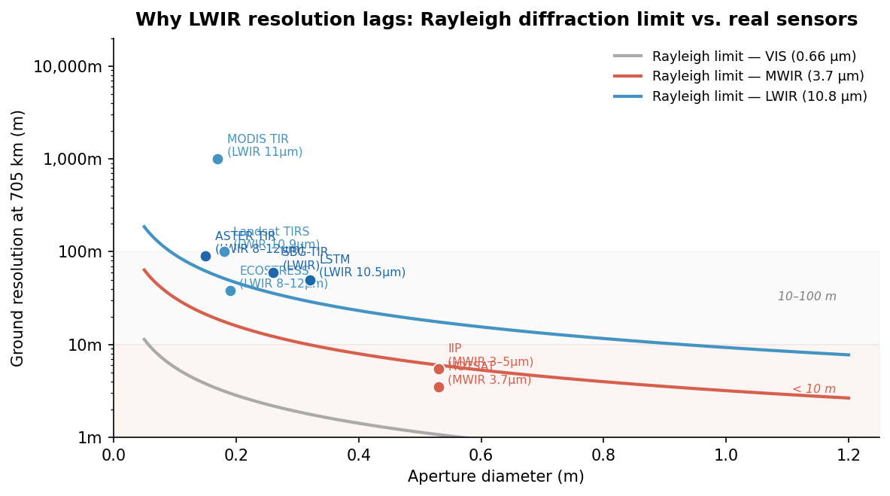
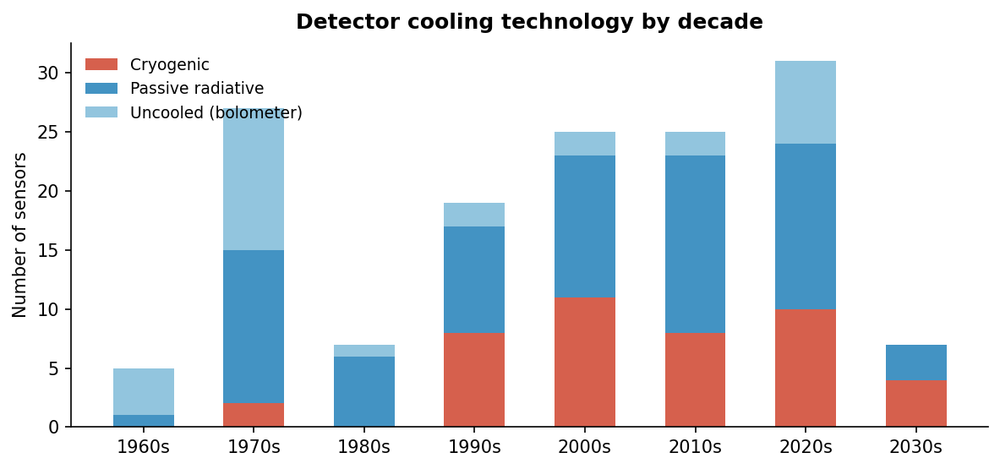

# A Data-Driven Perspective on Spaceborne Thermal Infrared Sensing

*Supplementary analysis for: Rezaie, H. & Hay, G. J. (2026). The Past, Present and Future of Thermal Remote Sensing. MDPI Remote Sensing.*

---

## Six Decades, Three Eras

The 171 sensors in this dataset tell a story with a clear structure. The first 30 years (1960–1990) were about proving the concept — a handful of government labs building one instrument at a time, mostly whiskbroom radiometers with passive cooling, mostly meteorological. The next 30 years (1990–2020) were about scientific maturity — hyperspectral sounders, cryogenically cooled imagers, and the first systematic land surface temperature records from ASTER, MODIS, and Landsat. The 2020s are something different: 31 new sensors in a single decade, with commercial operators entering a space that was previously the exclusive domain of NASA, ESA, JAXA, and Roscosmos.

*Figure 1. Spaceborne TIR sensors first operated per decade. The 2030s bar reflects only confirmed planned missions. MWIR+LWIR sensors (dark blue) dominate modern deployments, reflecting the maturity of broadband IR instrument design.*

Two numbers stand out from the timeline. First, sensors that cover both MWIR and LWIR (3–15 µm) have grown from 2 in the 1960s to 22 in the 2020s — not because single-band instruments disappeared, but because broadband FPA detectors made it cheap to cover the full atmospheric window. Second, pure MWIR sensors remain rare (6 across 60 years) because detecting at 3–5 µm in daylight requires rejecting solar-reflected radiation, adding complexity. Most broadband sensors handle this with temporal filtering rather than spectral separation.

---

## Why LWIR Cannot Match MWIR Resolution — and What It Would Take

The spatial resolution gap between MWIR and LWIR is not a funding or engineering priority problem. It is physics.

The Rayleigh criterion sets a hard floor: the minimum resolvable angle is 1.22 λ/D, where λ is wavelength and D is aperture. At 705 km altitude — Landsat's orbit — achieving 30 m ground resolution requires a 30 cm aperture at LWIR (10.8 µm) and only 8 cm at MWIR (3.7 µm). To match HOTSAT-1's 3.5 m MWIR resolution in the LWIR band would require an aperture of roughly **2.7 metres** deployed in orbit. No current or planned mission comes close to that.

*Figure 2. Rayleigh diffraction limits (lines) and actual sensor performance (dots) at 705 km altitude. MWIR sensors can approach or exceed 5 m resolution with compact apertures (0.2–0.5 m). LWIR sensors are pinned to 30–100 m with the same hardware because wavelength is 3× longer. Dashed region marks sub-10 m — achievable for MWIR today, not yet for LWIR.*

The data confirm this clearly. The best operational LWIR-only resolution today is 30 m (Landsat TM/ETM+, Landsat ETM, HiVE), with ECOSTRESS at 38 m and TIRS at 100 m. SuperSharp's planned 3 m LWIR imager (launching ~2027) proposes to break this barrier using a deployable telescope — a genuinely novel approach, not a refinement of existing designs. LSTM (50 m) and SBG-TIR (60 m) represent the institutional mainstream.

The practical implication for users: if you need sub-30 m thermal data today, you need MWIR (3–5 µm). LWIR (8–14 µm) gives you better sensitivity for ambient temperatures and no solar contamination, but at a spatial resolution cost that is baked into the physics of light.

---

## Detector Technology: The Arc from Uncooled to Cryogenic and Back

The earliest TIR satellites in the 1960s used uncooled detectors — simple bolometers and thermistor bolometers that required no cooling hardware. This was partly necessity (Stirling coolers were not flight-qualified) and partly acceptance of lower sensitivity for coarse-resolution meteorological work.

The 1990s marked the inflection point. Cryogenically cooled HgCdTe and InSb detectors, enabled by reliable Stirling-cycle mechanical coolers, became the standard for any sensor requiring high sensitivity or MWIR capability. ASTER, ATSR, SLSTR, CrIS, IASI — all use cryogenic cooling. By the 2000s, cryogenic and passive-radiative sensors were roughly equal in number, reflecting a field that had bifurcated: precision science instruments went cryogenic, moderate-resolution imagers stayed passive.

*Figure 3. Detector cooling by decade. Cryogenic sensors peaked in the 2000s alongside the EOS era (MODIS, ASTER, AIRS, CrIS). The resurgence of uncooled sensors in the 2020s reflects new-space entrants using microbolometer arrays (OroraTech, FOREST series, CIRC) that accept lower sensitivity in exchange for zero moving parts and drastically reduced mass and cost.*

The 2020s resurgence of uncooled sensors is not a regression — it is a deliberate trade. A microbolometer constellation of 20 satellites with 200 m resolution and 3-hour revisit can outperform a single cryogenic satellite at 100 m and 16-day revisit for wildfire detection or infrastructure monitoring. OroraTech's FOREST series operates on exactly this logic. The constraint is that uncooled bolometers cannot reach NEDT below ~30 mK, making them unsuitable for sea surface temperature retrieval or precise land surface temperature science. For those, cryogenic sensors remain irreplaceable.

---

## The New-Space Inflection and What It Means

Before 2020, 9 of the top 10 agencies by sensor count were government space agencies. NASA alone accounted for 22% of all sensors in this dataset. That structure has not reversed, but it is under pressure. Nine commercial TIR sensors are now operational or in deployment, most launched after 2022. Their resolution targets (3–30 m), revisit models (hours, not days), and business models (data-as-a-service, not mission archives) are structurally different from the government baseline.

The gap that commercial operators are filling is temporal resolution at high spatial resolution. Landsat 8/9 gives you 30 m thermal data but only every 8 days over a given point. ECOSTRESS covers the ISS footprint with variable overpass timing. No single satellite currently delivers sub-50 m TIR imagery at sub-daily revisit globally. HOTSAT-2/3, LSTM, TRISHNA, and the new commercial players are all explicitly targeting this gap — arriving at the same design problem from different directions (government science, commercial agriculture, commercial industrial monitoring).

Whether the LWIR resolution barrier at 30 m can be broken operationally before 2030 depends on SuperSharp's deployable telescope demonstrating on-orbit performance. If it does, the decadal resolution trend — stalled at 30 m since 1982 for LWIR — will break for the first time.

---

*Dataset: 171 sensors, 291 satellites, 1964–2050. Analysis conducted April 2026 using [sensors_tir.json](sensors_tir.json).*
